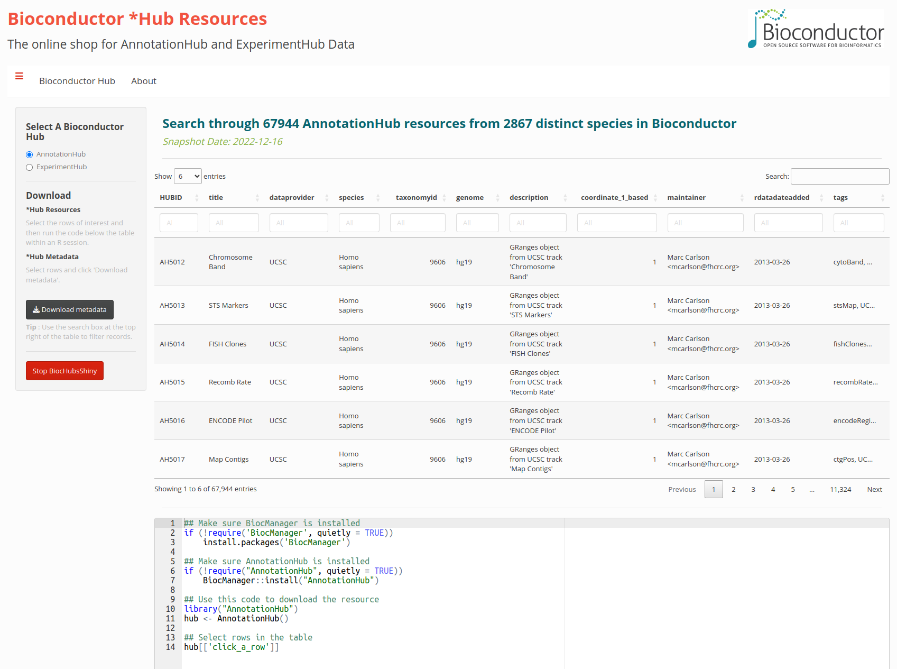
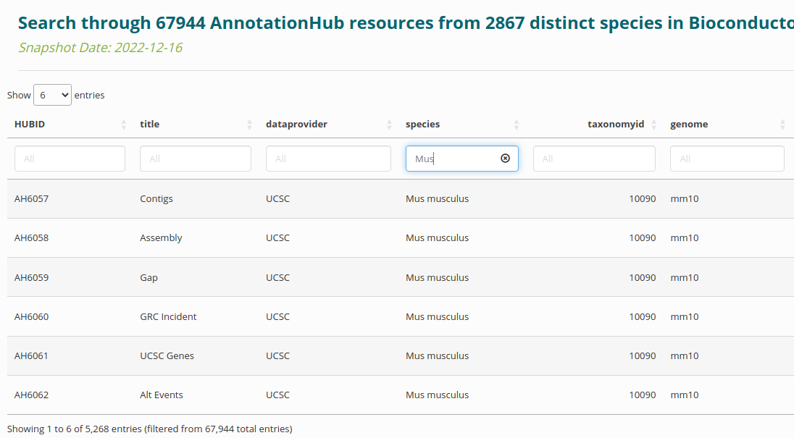
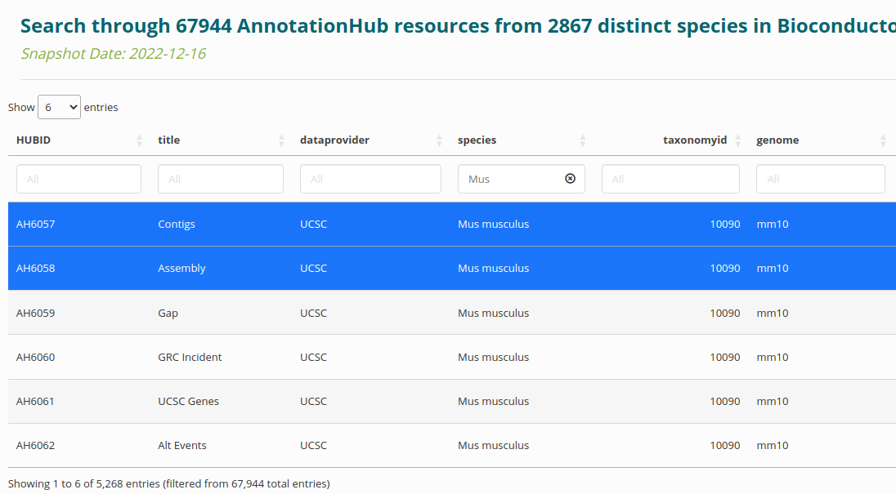
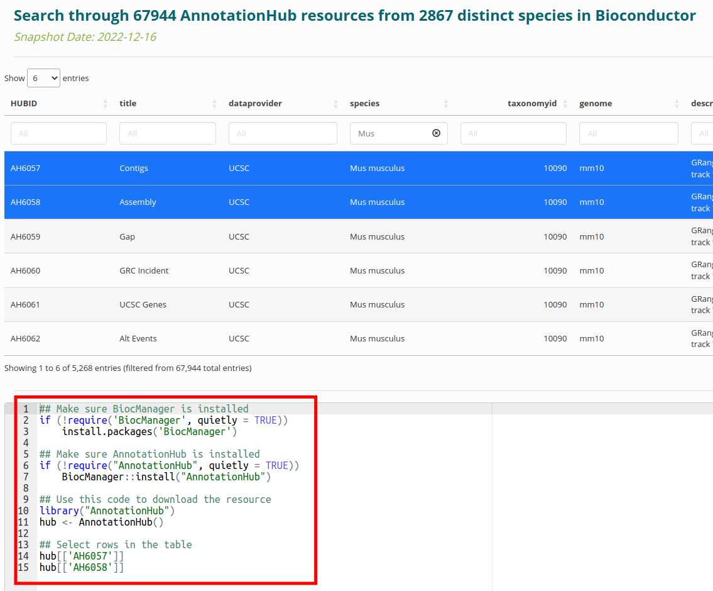

# BiocHubsShiny

The `BiocHubsShiny` package allows users to visually explore the `AnnotationHub`
and `ExperimentHub` resources via `shiny`. It provides a tabular display of the
available resources with the ability to filter and search through the column
fields.

# Installation

```{r,eval=FALSE}
if (!requireNamespace("BiocManager", quietly = TRUE))
    install.packages("BiocManager")

BiocManager::install("BiocHubsShiny")
```

# Loading the package

```{r,include=TRUE,results="hide",message=FALSE,warning=FALSE}
library(BiocHubsShiny)
```

# Display of resources

Resources are displayed interactively using the eponymous function:

```{r,eval=FALSE}
BiocHubsShiny()
```

```{r,echo=FALSE}

```

# Filtering

You can filter by any of the columns in the table. For example, you can search
for 'Mus musculus' to get resources only for that species:

```{r,echo=FALSE}

```

# Selection

Click on the rows to select the resources. They will show up as highlighted
rows.

```{r,echo=FALSE}

```

# Import

Once the selection is highlighted, the code at the bottom of the app
will be updated to show the commands for entering (reproducibly) into
the R session. 

```{r,echo=FALSE}

```

# Session Info

```{r}
sessionInfo()
```

